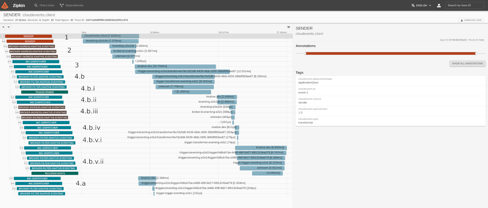

# 访问CloudEvent跟踪

根据您在Knative事件集群上安装的请求跟踪工具，有关如何可视化和跟踪请求的详细信息，请参阅相应的部分。

## 在开始之前

您必须有一个安装了事件处理组件并运行的Knative集群。[了解更多](../install/README.md).

## 配置跟踪

除了导入器之外，Knative事件跟踪是通过`knative-eventing`命名空间中的`config-tracing` ConfigMap配置的。

大多数导入器 _不_ 使用ConfigMap，而是使用静态的1%抽样率。

您可以使用`config-tracing` ConfigMap配置以下事件组件:

 - Brokers
 - Triggers
 - InMemoryChannel
 - ApiServerSource
 - PingSource
 - GitlabSource
 - KafkaSource
 - PrometheusSource

**举例:**

下面的示例`config-tracing` ConfigMap对所有CloudEvents的10%进行采样:

```yaml
apiVersion: v1
kind: ConfigMap
metadata:
  name: config-tracing
  namespace: knative-eventing
data:
  backend: "zipkin"
  zipkin-endpoint: "http://zipkin.istio-system.svc.cluster.local:9411/api/v2/spans"
  sample-rate: "0.1"
```

### 配置选项

你可以用以下选项配置你的`config-tracing`:

 * `backend`: Valid values are `zipkin`, `stackdriver`, or `none`. The default is `none`.

 * `zipkin-endpoint`: Specifies the URL to the zipkin collector where you want to send the traces.
   Must be set if backend is set to `zipkin`.

 * `stackdriver-project-id`: Specifies the GCP project ID into which the Stackdriver traces are written.
   You must specify the `backend` as `stackdriver`. If `backend`is unspecified, the GCP project ID is read
   from GCP metadata when running on GCP.

 * `sample-rate`: Specifies the sampling rate. Valid values are decimals from `0` to `1`
   (interpreted as a float64), which indicate the probability that any given request is sampled.
   An example value is `0.5`, which gives each request a 50% sampling probablity.

 * `debug`: Enables debugging. Valid values are `true` or `false`. Defaults to `false` when not specified.
   Set to `true` to enable debug mode, which forces the `sample-rate` to `1.0` and sends all spans to
   the server.

### 查看你的 `config-tracing` ConfigMap

To view your current configuration:

```bash
kubectl -n knative-eventing get configmap config-tracing -oyaml
```

### 编辑和部署 `config-tracing` ConfigMap

To edit and then immediately deploy changes to your ConfigMap, run the following command:

```bash
kubectl -n knative-eventing edit configmap config-tracing
```

## 在事件处理中访问跟踪

To access the traces, you use either the Zipkin or Jaeger tool. Details about using these tools to access traces are provided in the Knative Serving observability section:

 - [Zipkin](../serving/accessing-traces.md#zipkin)
 - [Jaeger](../serving/accessing-traces.md#jaeger)

### 举例

The following demonstrates how to trace requests in Knative Eventing with Zipkin, using the [`TestBrokerTracing`](https://github.com/knative/eventing/blob/main/test/conformance/broker_tracing_test.go) End-to-End test.

For this example, assume the following details:

- Everything happens in the `includes-incoming-trace-id-2qszn` namespace.
- The Broker is named `br`.
- There are two Triggers that are associated with the Broker:
    - `transformer` - Filters to only allow events whose type is `transformer`.
      Sends the event to the Kubernetes Service `transformer`, which will reply with an
      identical event, except the replied event's type will be `logger`.
    - `logger` - Filters to only allow events whose type is `logger`. Sends the event to
      the Kubernetes Service `logger`.
- An event is sent to the Broker with the type `transformer`, by the Pod named `sender`.

Given this scenario, the expected path and behavior of an event is as follows:

1. `sender` Pod sends the request to the Broker.
1. Go to the Broker's ingress Pod.
1. Go to the `imc-dispatcher` Channel (imc stands for InMemoryChannel).
1. Go to both Triggers.
    1. Go to the Broker's filter Pod for the Trigger `logger`. The Trigger's filter ignores this event.
    1. Go to the Broker's filter Pod for the Trigger `transformer`. The filter does pass, so it goes to the Kubernetes Service pointed at, also named `transformer`.
        1. `transformer` Pod replies with the modified event.
        1. Go to an InMemory dispatcher.
        1. Go to the Broker's ingress Pod.
        1. Go to the InMemory dispatcher.
        1. Go to both Triggers.
            1. Go to the Broker's filter Pod for the Trigger `transformer`. The Trigger's filter ignores the event.
            1. Go to the Broker's filter Pod for the Trigger `logger`. The filter passes.
                1. Go to the `logger` Pod. There is no reply.

This is a screenshot of the trace view in Zipkin. All the red letters have been added to the screenshot and correspond to the expectations earlier in this section:



This is the same screenshot without the annotations.


If you are interested, here is the [raw JSON](data/2e571e6948ff981283825bb2bf51c87d.json) of the trace.
