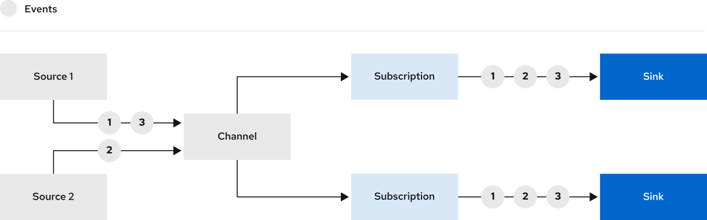

# 通道

通道是Kubernetes[自定义资源](https://kubernetes.io/docs/concepts/extend-kubernetes/api-extension/custom-resources/)，它定义了单个事件转发和持久层。

通道提供一种事件传递机制，可以通过订阅将接收到的事件扇向多个目的地或接收器。接收器的例子包括代理和Knative服务。

## 下一步

- 了解[默认可用通道类型](channel-types-defaults.md)
- 创建[通道](create-default-channel.md)
- 创建[订阅](subscriptions.md)
