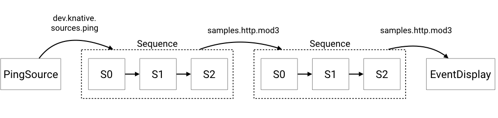

# 序列连接到另一个序列

我们将创建以下逻辑配置。
我们创建一个PingSource，向[`Sequence`](../README.md)提供事件，然后获取该`Sequence`的输出并将其发送给第二个`Sequence`，最后显示结果输出。



这些示例中使用的函数都在[https://github.com/knative/eventing/blob/main/cmd/appender/main.go](https://github.com/knative/eventing/blob/main/cmd/appender/main.go).

## 先决条件

对于本例，我们假设您已经设置了一个`InMemoryChannel`以及Knative服务(用于我们的函数)。
示例使用`default`名称空间，同样，如果您希望部署到另一个名称空间，则需要修改示例以反映这一点。

如果你想使用不同类型的`Channel`，你必须修改`Sequence.Spec.ChannelTemplate`来创建适当的通道资源。

## 设置

### 创建Knative服务

在下面的命令中修改`default`，在你想要创建资源的命名空间中创建步骤:

```yaml
apiVersion: serving.knative.dev/v1
kind: Service
metadata:
  name: first
spec:
  template:
    spec:
      containers:
        - image: gcr.io/knative-releases/knative.dev/eventing/cmd/appender
          env:
            - name: MESSAGE
              value: " - Handled by 0"

---
apiVersion: serving.knative.dev/v1
kind: Service
metadata:
  name: second
spec:
  template:
    spec:
      containers:
        - image: gcr.io/knative-releases/knative.dev/eventing/cmd/appender
          env:
            - name: MESSAGE
              value: " - Handled by 1"
---
apiVersion: serving.knative.dev/v1
kind: Service
metadata:
  name: third
spec:
  template:
    spec:
      containers:
        - image: gcr.io/knative-releases/knative.dev/eventing/cmd/appender
          env:
            - name: MESSAGE
              value: " - Handled by 2"
---
apiVersion: serving.knative.dev/v1
kind: Service
metadata:
  name: fourth
spec:
  template:
    spec:
      containers:
        - image: gcr.io/knative-releases/knative.dev/eventing/cmd/appender
          env:
            - name: MESSAGE
              value: " - Handled by 3"

---
apiVersion: serving.knative.dev/v1
kind: Service
metadata:
  name: fifth
spec:
  template:
    spec:
      containers:
        - image: gcr.io/knative-releases/knative.dev/eventing/cmd/appender
          env:
            - name: MESSAGE
              value: " - Handled by 4"
---
apiVersion: serving.knative.dev/v1
kind: Service
metadata:
  name: sixth
spec:
  template:
    spec:
      containers:
        - image: gcr.io/knative-releases/knative.dev/eventing/cmd/appender
          env:
            - name: MESSAGE
              value: " - Handled by 5"
---

```

```bash
kubectl -n default create -f ./steps.yaml
```

### 创建第一个序列

`sequence1.yaml`文件包含创建序列的规范。
如果使用不同类型的通道，则需要更改`spec.channelTemplate`以指向所需的通道。

```yaml
apiVersion: flows.knative.dev/v1
kind: Sequence
metadata:
  name: first-sequence
spec:
  channelTemplate:
    apiVersion: messaging.knative.dev/v1
    kind: InMemoryChannel
  steps:
    - ref:
        apiVersion: serving.knative.dev/v1
        kind: Service
        name: first
    - ref:
        apiVersion: serving.knative.dev/v1
        kind: Service
        name: second
    - ref:
        apiVersion: serving.knative.dev/v1
        kind: Service
        name: third
  reply:
    ref:
      kind: Sequence
      apiVersion: flows.knative.dev/v1
      name: second-sequence
```

在下面的命令中修改`default`，在你想要创建资源的命名空间中创建`Sequence`:

```bash
kubectl -n default create -f ./sequence1.yaml
```

### 创建第二个序列

`sequence2.yaml` 文件包含了创建序列的规范。
如果使用不同类型的通道，则需要更改`spec.channelTemplate`以指向所需的通道。

```yaml
apiVersion: flows.knative.dev/v1
kind: Sequence
metadata:
  name: second-sequence
spec:
  channelTemplate:
    apiVersion: messaging.knative.dev/v1
    kind: InMemoryChannel
  steps:
    - ref:
        apiVersion: serving.knative.dev/v1
        kind: Service
        name: fourth
    - ref:
        apiVersion: serving.knative.dev/v1
        kind: Service
        name: fifth
    - ref:
        apiVersion: serving.knative.dev/v1
        kind: Service
        name: sixth
  reply:
    ref:
      kind: Service
      apiVersion: serving.knative.dev/v1
      name: event-display
```

```bash
kubectl -n default create -f ./sequence2.yaml
```

### 创建按顺序显示事件的服务

```yaml
apiVersion: serving.knative.dev/v1
kind: Service
metadata:
  name: event-display
spec:
  template:
    spec:
      containers:
        - image: gcr.io/knative-releases/knative.dev/eventing/cmd/event_display
```

在下面的命令中修改`default`，在你想要创建资源的命名空间中创建`Sequence`:

```bash
kubectl -n default create -f ./event-display.yaml
```

### 创建针对第一个序列的PingSource

这将创建一个PingSource，它将每2分钟发送一个带有`{"message": "Hello world!"}`作为数据负载的CloudEvent。

```yaml
apiVersion: sources.knative.dev/v1
kind: PingSource
metadata:
  name: ping-source
spec:
  schedule: "*/2 * * * *"
  contentType: "application/json"
  data: '{"message": "Hello world!"}'
  sink:
    ref:
      apiVersion: flows.knative.dev/v1
      kind: Sequence
      name: first-sequence
```

```bash
kubectl -n default create -f ./ping-source.yaml
```

### 检查结果

现在可以通过检查事件显示Pods的日志看到最终的输出。

```bash
kubectl -n default get pods
```

然后查看事件显示Pod的日志:

```bash
kubectl -n default logs -l serving.knative.dev/service=event-display -c user-container --tail=-1
☁️  cloudevents.Event
Validation: valid
Context Attributes,
  specversion: 1.0
  type: dev.knative.sources.ping
  source: /apis/v1/namespaces/default/pingsources/ping-source
  id: 29d531df-78d8-4d11-9ffd-ba24045241a9
  time: 2020-03-02T21:18:00.0011708Z
  datacontenttype: application/json
Extensions,
  knativehistory: first-sequence-kn-sequence-0-kn-channel.default.svc.cluster.local; first-sequence-kn-sequence-1-kn-channel.default.svc.cluster.local; first-sequence-kn-sequence-2-kn-channel.default.svc.cluster.local; second-sequence-kn-sequence-0-kn-channel.default.svc.cluster.local; second-sequence-kn-sequence-1-kn-channel.default.svc.cluster.local; second-sequence-kn-sequence-2-kn-channel.default.svc.cluster.local
  traceparent: 00-e5abc9de525a89ead80560b8f328de5c-fc12b64a6296f541-00
Data,
  {
    "id": 0,
    "message": "Hello world! - Handled by 0 - Handled by 1 - Handled by 2 - Handled by 3 - Handled by 4 - Handled by 5"
  }
```

你可以看到初始的PingSource消息`("Hello World!")`已经被序列中的每一个步骤附加到它上面。
