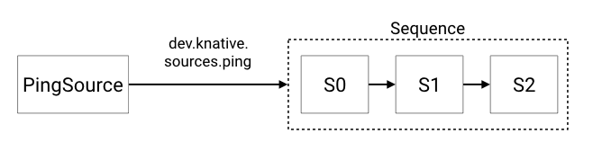

# 序列终端

我们将创建以下逻辑配置。
我们创建一个PingSource，向[`Sequence`](../README.md)提供事件。
序列可以进行外部工作，或者在带外创建额外的事件。



这些示例中使用的函数都位于: [https://github.com/knative/eventing/blob/main/cmd/appender/main.go](https://github.com/knative/eventing/blob/main/cmd/appender/main.go).

## 先决条件

在这个例子中，我们假设你已经设置了一个`InMemoryChannel`和Knative服务(用于我们的函数)。
示例使用`default`名称空间，同样，如果您希望部署到另一个名称空间，您将需要修改示例以反映这一点。

如果你想使用不同类型的`Channel`，你必须修改`Sequence.Spec.ChannelTemplate`来创建适当的通道资源。

## 设置

### 创建Knative服务

首先创建将在步骤中引用的3个步骤。

```yaml
apiVersion: serving.knative.dev/v1
kind: Service
metadata:
  name: first
spec:
  template:
    spec:
      containers:
        - image: gcr.io/knative-releases/knative.dev/eventing/cmd/appender
          env:
            - name: MESSAGE
              value: " - Handled by 0"

---
apiVersion: serving.knative.dev/v1
kind: Service
metadata:
  name: second
spec:
  template:
    spec:
      containers:
        - image: gcr.io/knative-releases/knative.dev/eventing/cmd/appender
          env:
            - name: MESSAGE
              value: " - Handled by 1"
---
apiVersion: serving.knative.dev/v1
kind: Service
metadata:
  name: third
spec:
  template:
    spec:
      containers:
        - image: gcr.io/knative-releases/knative.dev/eventing/cmd/appender
          env:
            - name: MESSAGE
              value: " - Handled by 2"
---

```

```bash
kubectl -n default create -f ./steps.yaml
```

### 创建序列

`sequence.yaml`文件包含了创建序列的规范。
如果使用不同类型的通道，则需要更改`spec.channelTemplate`以指向所需的通道。

```yaml
apiVersion: flows.knative.dev/v1
kind: Sequence
metadata:
  name: sequence
spec:
  channelTemplate:
    apiVersion: messaging.knative.dev/v1
    kind: InMemoryChannel
  steps:
    - ref:
        apiVersion: serving.knative.dev/v1
        kind: Service
        name: first
    - ref:
        apiVersion: serving.knative.dev/v1
        kind: Service
        name: second
    - ref:
        apiVersion: serving.knative.dev/v1
        kind: Service
        name: third
```

在下面的命令中修改`default`，在你想要创建资源的命名空间中创建`Sequence`:

```bash
kubectl -n default create -f ./sequence.yaml
```

### 创建针对序列的PingSource

这将创建一个PingSource，它将每2分钟发送一个带有`{"message": "Hello world!"}`作为数据负载的CloudEvent。

```yaml
apiVersion: sources.knative.dev/v1
kind: PingSource
metadata:
  name: ping-source
spec:
  schedule: "*/2 * * * *"
  contentType: "application/json"
  data: '{"message": "Hello world!"}'
  sink:
    ref:
      apiVersion: flows.knative.dev/v1
      kind: Sequence
      name: sequence
```

```bash
kubectl -n default create -f ./ping-source.yaml
```

### 检查结果

现在可以通过检查事件显示Pods的日志看到最终的输出。
注意，由于我们将`PingSource`设置为每2分钟发出一次，所以事件在日志中显示可能需要一些时间。

```bash
kubectl -n default get pods
```

让我们看看 `Sequence` 中第一步的日志:

```bash
kubectl -n default logs -l serving.knative.dev/service=first -c user-container --tail=-1

2020/03/02 21:28:00 listening on 8080, appending " - Handled by 0" to events
2020/03/02 21:28:01 Received a new event:
2020/03/02 21:28:01 [2020-03-02T21:28:00.0010247Z] /apis/v1/namespaces/default/pingsources/ping-source dev.knative.sources.ping: &{Sequence:0 Message:Hello world!}
2020/03/02 21:28:01 Transform the event to:
2020/03/02 21:28:01 [2020-03-02T21:28:00.0010247Z] /apis/v1/namespaces/default/pingsources/ping-source dev.knative.sources.ping: &{Sequence:0 Message:Hello world! - Handled by 0}
```
您可以看到，初始的PingSource消息`("Hello World!")`现在已经被序列中的第一步修改为包含" - Handled by 0"。激动人心的:)

然后我们可以看看 `Sequence` 中第二步的输出:

```bash
kubectl -n default logs -l serving.knative.dev/service=second -c user-container --tail=-1

2020/03/02 21:28:02 listening on 8080, appending " - Handled by 1" to events
2020/03/02 21:28:02 Received a new event:
2020/03/02 21:28:02 [2020-03-02T21:28:00.0010247Z] /apis/v1/namespaces/default/pingsources/ping-source dev.knative.sources.ping: &{Sequence:0 Message:Hello world! - Handled by 0}
2020/03/02 21:28:02 Transform the event to:
2020/03/02 21:28:02 [2020-03-02T21:28:00.0010247Z] /apis/v1/namespaces/default/pingsources/ping-source dev.knative.sources.ping: &{Sequence:0 Message:Hello world! - Handled by 0 - Handled by 1}
```
正如预期的那样，它现在由第一步和第二步处理，反映在现在的消息中:"Hello world! - Handled by 0 - Handled by 1"

然后我们可以看看 `Sequence` 中最后一步的输出:

```bash
kubectl -n default logs -l serving.knative.dev/service=third -c user-container --tail=-1

2020/03/02 21:28:03 listening on 8080, appending " - Handled by 2" to events
2020/03/02 21:28:03 Received a new event:
2020/03/02 21:28:03 [2020-03-02T21:28:00.0010247Z] /apis/v1/namespaces/default/pingsources/ping-source dev.knative.sources.ping: &{Sequence:0 Message:Hello world! - Handled by 0 - Handled by 1}
2020/03/02 21:28:03 Transform the event to:
2020/03/02 21:28:03 [2020-03-02T21:28:00.0010247Z] /apis/v1/namespaces/default/pingsources/ping-source dev.knative.sources.ping: &{Sequence:0 Message:Hello world! - Handled by 0 - Handled by 1 - Handled by 2}
```
