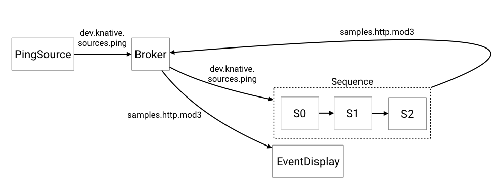

# 使用带有代理和触发器的序列

我们将创建以下逻辑配置。
我们创建一个PingSource，向代理提供事件，然后创建一个“过滤器”，将这些事件连接到一个由3个步骤组成的[序列](../README.md)中。
然后取序列的末尾，将新生成的事件反馈给代理，并创建另一个触发器，该触发器将显示这些事件。

## 先决条件

- Knative 服务
- `InMemoryChannel`

!!! note
    这些示例使用`default`名称空间。

如果你想使用不同类型的“通道”，你必须修改`Sequence.Spec.ChannelTemplate`来创建适当的通道资源。



这些示例中使用的函数位于[https://github.com/knative/eventing/blob/main/cmd/appender/main.go](https://github.com/knative/eventing/blob/main/cmd/appender/main.go).

## 设置

### 创建代理

1. 要创建集群默认的Broker类型，请将以下YAML复制到一个文件中:

    ```yaml
    apiVersion: eventing.knative.dev/v1
    kind: Broker
    metadata:
     name: default
    ```

1. 运行以下命令应用YAML文件:

    ```bash
    kubectl apply -f <filename>.yaml
    ```
    其中 `<filename>` 是您在上一步中创建的文件的名称。

### 创建服务

```yaml
apiVersion: serving.knative.dev/v1
kind: Service
metadata:
  name: first
spec:
  template:
    spec:
      containers:
        - image: gcr.io/knative-releases/knative.dev/eventing/cmd/appender
          env:
            - name: MESSAGE
              value: " - Handled by 0"

---
apiVersion: serving.knative.dev/v1
kind: Service
metadata:
  name: second
spec:
  template:
    spec:
      containers:
        - image: gcr.io/knative-releases/knative.dev/eventing/cmd/appender
          env:
            - name: MESSAGE
              value: " - Handled by 1"
---
apiVersion: serving.knative.dev/v1
kind: Service
metadata:
  name: third
spec:
  template:
    spec:
      containers:
        - image: gcr.io/knative-releases/knative.dev/eventing/cmd/appender
          env:
            - name: MESSAGE
              value: " - Handled by 2"
            - name: TYPE
              value: "samples.http.mod3"
---

```

在以下命令中更改 `default`，在您配置代理的命名空间中创建服务:

```bash
kubectl -n default create -f ./steps.yaml
```

### 创建序列

`sequence.yaml`文件包含了创建序列的规范。
如果使用不同类型的通道，则需要更改`spec.channelTemplate`以指向所需的通道。

另外，将`spec.reply.name`更改为指向您的代理

```yaml
apiVersion: flows.knative.dev/v1
kind: Sequence
metadata:
  name: sequence
spec:
  channelTemplate:
    apiVersion: messaging.knative.dev/v1
    kind: InMemoryChannel
  steps:
    - ref:
        apiVersion: serving.knative.dev/v1
        kind: Service
        name: first
    - ref:
        apiVersion: serving.knative.dev/v1
        kind: Service
        name: second
    - ref:
        apiVersion: serving.knative.dev/v1
        kind: Service
        name: third
  reply:
    ref:
      kind: Broker
      apiVersion: eventing.knative.dev/v1
      name: default
```

在以下命令中更改 `default`，以在您配置代理的名称空间中创建序列:

```bash
kubectl -n default create -f ./sequence.yaml
```

### 创建针对代理的PingSource

这将创建一个PingSource，它将每隔2分钟发送一个CloudEvent，并将`{"message":"Hello world!"}`作为数据有效负载。

```yaml
apiVersion: sources.knative.dev/v1
kind: PingSource
metadata:
  name: ping-source
spec:
  schedule: "*/2 * * * *"
  contentType: "application/json"
  data: '{"message": "Hello world!"}'
  sink:
    ref:
      apiVersion: eventing.knative.dev/v1
      kind: Broker
      name: default
```

在以下命令中更改 `default`，在您配置代理和序列的命名空间中创建PingSource:

```bash
kubectl -n default create -f ./ping-source.yaml
```

### 创建针对序列的触发器

```yaml
apiVersion: eventing.knative.dev/v1
kind: Trigger
metadata:
  name: sequence-trigger
spec:
  broker: default
  filter:
    attributes:
      type: dev.knative.sources.ping
  subscriber:
    ref:
      apiVersion: flows.knative.dev/v1
      kind: Sequence
      name: sequence
```

在以下命令中更改 `default`，在您配置代理和序列的命名空间中创建触发器:

```bash
kubectl -n default create -f ./trigger.yaml

```

### 创建服务和触发器，显示按顺序创建的事件

```yaml
apiVersion: serving.knative.dev/v1
kind: Service
metadata:
  name: sequence-display
spec:
  template:
    spec:
      containers:
        - image: gcr.io/knative-releases/knative.dev/eventing/cmd/event_display
---
apiVersion: eventing.knative.dev/v1
kind: Trigger
metadata:
  name: display-trigger
spec:
  broker: default
  filter:
    attributes:
      type: samples.http.mod3
  subscriber:
    ref:
      apiVersion: serving.knative.dev/v1
      kind: Service
      name: sequence-display
---

```

在以下命令中更改 `default`，以在您配置代理的名称空间中创建服务并触发:

```bash
kubectl -n default create -f ./display-trigger.yaml
```

### 检查结果

您现在可以通过检查序列显示Pods的日志看到最终的输出。

```bash
kubectl -n default get pods
```

查看`sequence-display` Pod的日志:

```bash
kubectl -n default logs -l serving.knative.dev/service=sequence-display -c user-container --tail=-1
☁️  cloudevents.Event
Validation: valid
Context Attributes,
  specversion: 1.0
  type: samples.http.mod3
  source: /apis/v1/namespaces/default/pingsources/ping-source
  id: 159bba01-054a-4ae7-b7be-d4e7c5f773d2
  time: 2020-03-03T14:56:00.000652027Z
  datacontenttype: application/json
Extensions,
  knativearrivaltime: 2020-03-03T14:56:00.018390608Z
  knativehistory: default-kne-trigger-kn-channel.default.svc.cluster.local; sequence-kn-sequence-0-kn-channel.default.svc.cluster.local; sequence-kn-sequence-1-kn-channel.default.svc.cluster.local; sequence-kn-sequence-2-kn-channel.default.svc.cluster.local; default-kne-trigger-kn-channel.default.svc.cluster.local
  traceparent: 00-e893412106ff417a90a5695e53ffd9cc-5829ae45a14ed462-00
Data,
  {
    "id": 0,
    "message": "Hello world! - Handled by 0 - Handled by 1 - Handled by 2"
  }
```

你可以看到初始的PingSource消息`{"Hello World!"}`被序列中的每个步骤附加到它后面。
