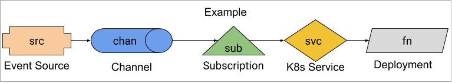

# 调试Knative事件

这是一个关于如何调试一个不能工作的Knative事件设置的不断发展的文档。

## 观众

本文档适用于熟悉[Knative事件](../README.md)的对象模型的人。
你不需要成为专家，但需要大致了解事物是如何组合在一起的。

## 先决条件

1. 设置[Knative事件和事件贡献资源](../README.md).

## 例子

本指南使用了一个由事件源组成的示例，该事件源向函数发送事件。



参见[example.yaml](example.yaml)了解整个YAML。
要使本指南中的任何命令生效，必须应用[example.yaml](example.yaml):

```bash
kubectl apply --filename example.yaml
```

## 触发事件

Knative事件将在`knative-debug`命名空间中发生Kubernetes[`Event`](https://kubernetes.io/docs/reference/generated/kubernetes-api/v1.18/#event-v1-core)时发生。
我们可以通过以下命令来实现:

```bash
kubectl --namespace knative-debug run to-be-deleted --image=image-that-doesnt-exist --restart=Never
# 5 seconds is arbitrary. We want K8s to notice that the Pod needs to be scheduled and generate at least one event.
sleep 5
kubectl --namespace knative-debug delete pod to-be-deleted
```

然后我们可以看到Kubernetes的事件(注意，这些不是Knative事件!):

```bash
kubectl --namespace knative-debug get events
```

这将产生如下的输出:

```{ .bash .no-copy }
LAST SEEN   FIRST SEEN   COUNT     NAME                             KIND      SUBOBJECT                        TYPE      REASON                   SOURCE                                         MESSAGE
20s         20s          1         to-be-deleted.157aadb9f376fc4e   Pod                                        Normal    Scheduled                default-scheduler                              Successfully assigned knative-debug/to-be-deleted to gke-kn24-default-pool-c12ac83b-pjf2
```

## 我的活动在哪里?

你已经应用了[example.yaml](example.yaml)，并且正在检查`fn`的日志:

```bash
kubectl --namespace knative-debug logs -l app=fn -c user-container
```

但是你看不到任何事件的到来。问题在哪里?

### 检查已创建的资源

首先要检查的是所有创建的资源，他们的状态包含`ready` true?

我们将尝试从最基本的部分来确定原因:

1. `fn` - `Deployment` 在Knative中没有依赖关系。
2. `svc` - `Service` 在Knative内部没有依赖关系。
3. `chan` - `Channel` 取决于它的支持`channel implementation`和一些取决于`sub`。
4. `src` - `Source` 取决于  `chan`.
5. `sub` - `Subscription` 取决于`chan` 和 `svc`.

#### `fn`

```bash
kubectl --namespace knative-debug get deployment fn -o jsonpath='{.status.availableReplicas}'
```

我们想看到`1`。
如果你没有，那么你需要调试`Deployment`。
`status`中有什么明显的错误吗?

```bash
kubectl --namespace knative-debug get deployment fn --output yaml
```

如果问题不明显，那么您需要调试“部署”，这超出了本文的范围。

确认`Pod` 为 `Ready`:

```bash
kubectl --namespace knative-debug get pod -l app=fn -o jsonpath='{.items[*].status.conditions[?(@.type == "Ready")].status}'
```

This should return `True`. If it doesn't, then try to debug the `Deployment`
using the
[Kubernetes Application Debugging](https://kubernetes.io/docs/tasks/debug-application-cluster/debug-application-introspection/)
guide.

#### `svc`

```bash
kubectl --namespace knative-debug get service svc
```

We just want to ensure this exists and has the correct name. If it doesn't
exist, then you probably need to re-apply [example.yaml](example.yaml).

Verify it points at the expected pod.

```bash

svcLabels=$(kubectl --namespace knative-debug get service svc -o go-template='{{range $k, $v := .spec.selector}}{{ $k }}={{ $v }},{{ end }}' | sed 's/.$//' )
kubectl --namespace knative-debug get pods -l $svcLabels

```

This should return a single Pod, which if you inspect is the one generated by
`fn`.

#### `chan`

`chan` uses the
[`in-memory-channel`](https://github.com/knative/eventing/tree/{{ branch }}/config/channels/in-memory-channel).
This is a very basic channel and has few
failure modes that will be exhibited in `chan`'s `status`.

```bash
kubectl --namespace knative-debug get channel.messaging.knative.dev chan -o jsonpath='{.status.conditions[?(@.type == "Ready")].status}'
```

This should return `True`. If it doesn't, get the full resource:

```bash
kubectl --namespace knative-debug get channel.messaging.knative.dev chan --output yaml
```

If `status` is completely missing, it implies that something is wrong with the
`in-memory-channel` controller. See [Channel Controller](#channel-controller).

Next verify that `chan` is addressable:

```bash
kubectl --namespace knative-debug get channel.messaging.knative.dev chan -o jsonpath='{.status.address.hostname}'
```

This should return a URI, likely ending in '.cluster.local'. If it doesn't, then
it implies that something went wrong during reconciliation. See
[Channel Controller](#channel-controller).

We will verify that the two resources that the `chan` creates exist and are
`Ready`.

#### `Service`

`chan` creates a K8s `Service`.

```bash
kubectl --namespace knative-debug get service -l messaging.knative.dev/role=in-memory-channel
```

It's spec is completely unimportant, as Istio will ignore it. It just needs to
exist so that `src` can send events to it. If it doesn't exist, it implies that
something went wrong during `chan` reconciliation. See
[Channel Controller](#channel-controller).

#### `src`

`src` is a [`ApiServerSource`](../../eventing/sources/apiserversource/README.md).

First we will verify that `src` is writing to `chan`.

```bash
kubectl --namespace knative-debug get apiserversource src -o jsonpath='{.spec.sink}'
```

Which should return
`map[apiVersion:messaging.knative.dev/v1 kind:Channel name:chan]`. If it
doesn't, then `src` was setup incorrectly and its `spec` needs to be fixed.
Fixing should be as simple as updating its `spec` to have the correct `sink`
(see [example.yaml](example.yaml)).

Now that we know `src` is sending to `chan`, let's verify that it is `Ready`.

```bash
kubectl --namespace knative-debug get apiserversource src -o jsonpath='{.status.conditions[?(.type == "Ready")].status}'
```

#### `sub`

`sub` is a `Subscription` from `chan` to `fn`.

Verify that `sub` is `Ready`:

```bash
kubectl --namespace knative-debug get subscription sub -o jsonpath='{.status.conditions[?(.type == "Ready")].status}'
```

This should return `True`. If it doesn't then, look at all the status entries.

```bash
kubectl --namespace knative-debug get subscription sub --output yaml
```

### 控制器

Each of the resources has a Controller that is watching it. As of today, they
tend to do a poor job of writing failure status messages and events, so we need
to look at the Controller's logs.

!!! note

    The Kubernetes Deployment Controller, which controls `fn`, is out of scope for this document.

#### 服务控制器

The Kubernetes Service Controller, controlling `svc`, is out of scope for this
document.

#### 通道控制器

There is not a single `Channel` Controller. Instead, there is one
Controller for each Channel CRD. `chan` uses the
`InMemoryChannel` `Channel CRD`, whose Controller is:

```bash
kubectl --namespace knative-eventing get pod -l messaging.knative.dev/channel=in-memory-channel,messaging.knative.dev/role=controller --output yaml
```

See its logs with:

```bash
kubectl --namespace knative-eventing logs -l messaging.knative.dev/channel=in-memory-channel,messaging.knative.dev/role=controller
```

Pay particular attention to any lines that have a logging level of `warning` or
`error`.

#### 源控制器

Each Source will have its own Controller. `src` is a `ApiServerSource`, so
its Controller is:

```bash
kubectl --namespace knative-eventing get pod -l app=sources-controller
```

This is actually a single binary that runs multiple Source Controllers,
importantly including [ApiServerSource Controller](#apiserversource-controller).

#### ApiServerSource 控制器

The `ApiServerSource` Controller is run in the same binary as some other Source
Controllers from Eventing. It is:

```bash
kubectl --namespace knative-debug get pod -l eventing.knative.dev/sourceName=src,eventing.knative.dev/source=apiserver-source-controller
```

View its logs with:

```bash
kubectl --namespace knative-debug logs -l eventing.knative.dev/sourceName=src,eventing.knative.dev/source=apiserver-source-controller
```

Pay particular attention to any lines that have a logging level of `warning` or
`error`.

#### 订阅控制器

The `Subscription` Controller controls `sub`. It attempts to resolve the
addresses that a `Channel` should send events to, and once resolved, inject
those into the `Channel`'s `spec.subscribable`.

```bash
kubectl --namespace knative-eventing get pod -l app=eventing-controller
```

View its logs with:

```bash
kubectl --namespace knative-eventing logs -l app=eventing-controller
```

Pay particular attention to any lines that have a logging level of `warning` or
`error`.

### 数据平面

The entire [Control Plane](#control-plane) looks healthy, but we're still not
getting any events. Now we need to investigate the data plane.

The Knative event takes the following path:

1. Event is generated by `src`.

   - In this case, it is caused by having a Kubernetes `Event` trigger it, but
     as far as Knative is concerned, the `Source` is generating the event denovo
     (from nothing).

1. `src` is POSTing the event to `chan`'s address,
   `http://chan-kn-channel.knative-debug.svc.cluster.local`.

1. The Channel Dispatcher receives the request and introspects the Host header
   to determine which `Channel` it corresponds to. It sees that it corresponds
   to `knative-debug/chan` so forwards the request to the subscribers defined in
   `sub`, in particular `svc`, which is backed by `fn`.

1. `fn` receives the request and logs it.

We will investigate components in the order in which events should travel.

#### 通道分配器

The Channel Dispatcher is the component that receives POSTs pushing events into
`Channel`s and then POSTs to subscribers of those `Channel`s when an event is
received. For the `in-memory-channel` used in this example, there is a single
binary that handles both the receiving and dispatching sides for all
`in-memory-channel` `Channel`s.

First we will inspect the Dispatcher's logs to see if it is anything obvious:

```bash
kubectl --namespace knative-eventing logs -l messaging.knative.dev/channel=in-memory-channel,messaging.knative.dev/role=dispatcher -c dispatcher
```

Ideally we will see lines like:

```{ .bash .no-copy }
{"level":"info","ts":"2019-08-16T13:50:55.424Z","logger":"inmemorychannel-dispatcher.in-memory-channel-dispatcher","caller":"provisioners/message_receiver.go:147","msg":"Request mapped to channel: knative-debug/chan-kn-channel","knative.dev/controller":"in-memory-channel-dispatcher"}
{"level":"info","ts":"2019-08-16T13:50:55.425Z","logger":"inmemorychannel-dispatcher.in-memory-channel-dispatcher","caller":"provisioners/message_dispatcher.go:112","msg":"Dispatching message to http://svc.knative-debug.svc.cluster.local/","knative.dev/controller":"in-memory-channel-dispatcher"}
{"level":"info","ts":"2019-08-16T13:50:55.981Z","logger":"inmemorychannel-dispatcher.in-memory-channel-dispatcher","caller":"provisioners/message_receiver.go:140","msg":"Received request for chan-kn-channel.knative-debug.svc.cluster.local","knative.dev/controller":"in-memory-channel-dispatcher"}
```

Which shows that the request is being received and then sent to `svc`, which is
returning a 2XX response code (likely 200, 202, or 204).

However if we see something like:

<!--
 NOTE: This error has been produced by settings spec.ports[0].port to 8081
 kubectl patch -n knative-debug svc svc -p '{"spec":{"ports": [{"port": 8081, "targetPort":8080}]}}' --type='merge'
-->
```{ .bash .no-copy }
{"level":"info","ts":"2019-08-16T16:10:16.859Z","logger":"inmemorychannel-dispatcher.in-memory-channel-dispatcher","caller":"provisioners/message_receiver.go:140","msg":"Received request for chan-kn-channel.knative-debug.svc.cluster.local","knative.dev/controller":"in-memory-channel-dispatcher"}
{"level":"info","ts":"2019-08-16T16:10:16.859Z","logger":"inmemorychannel-dispatcher.in-memory-channel-dispatcher","caller":"provisioners/message_receiver.go:147","msg":"Request mapped to channel: knative-debug/chan-kn-channel","knative.dev/controller":"in-memory-channel-dispatcher"}
{"level":"info","ts":"2019-08-16T16:10:16.859Z","logger":"inmemorychannel-dispatcher.in-memory-channel-dispatcher","caller":"provisioners/message_dispatcher.go:112","msg":"Dispatching message to http://svc.knative-debug.svc.cluster.local/","knative.dev/controller":"in-memory-channel-dispatcher"}
{"level":"error","ts":"2019-08-16T16:10:38.169Z","logger":"inmemorychannel-dispatcher.in-memory-channel-dispatcher","caller":"fanout/fanout_handler.go:121","msg":"Fanout had an error","knative.dev/controller":"in-memory-channel-dispatcher","error":"Unable to complete request Post http://svc.knative-debug.svc.cluster.local/: dial tcp 10.4.44.156:80: i/o timeout","stacktrace":"knative.dev/eventing/pkg/provisioners/fanout.(*Handler).dispatch\n\t/Users/xxxxxx/go/src/knative.dev/eventing/pkg/provisioners/fanout/fanout_handler.go:121\nknative.dev/eventing/pkg/provisioners/fanout.createReceiverFunction.func1.1\n\t/Users/i512777/go/src/knative.dev/eventing/pkg/provisioners/fanout/fanout_handler.go:95"}
```

Then we know there was a problem posting to
`http://svc.knative-debug.svc.cluster.local/`.

<!--TODO Finish this section. Especially after the Channel Dispatcher emits K8s
events about failures.-->
