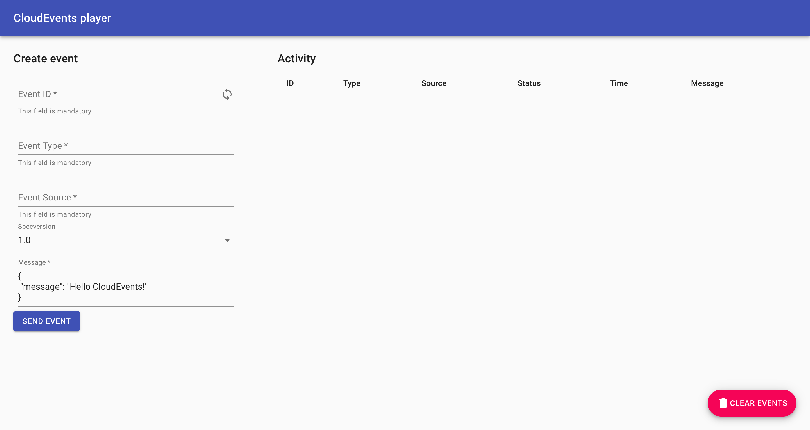
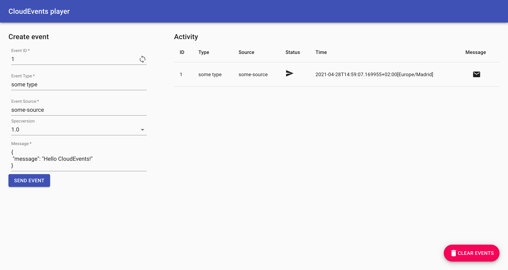

# 第一个源

在本教程中，您将使用[CloudEvents Player](https://github.com/ruromero/cloudevents-player){target=blank}应用程序来展示 Knative 事件的核心概念。
在本教程结束时，您应该拥有一个如下所示的体系结构:


上面的图像是[Knative in Action](https://www.manning.com/books/knative-in-action){target=\_blank}的图 6.6

## 创建第一个源

通过将代理的 URL(`BROKER_URL`)作为环境变量，CloudEvents Player 充当了 CloudEvents 的源。
您将通过 CloudEvents Player 应用程序向代理发送 CloudEvents。

创建 CloudEvents Player 服务:

=== "kn"

    运行以下命令:

    ```bash
    kn service create cloudevents-player \
    --image ruromero/cloudevents-player:latest \
    --env BROKER_URL=http://broker-ingress.knative-eventing.svc.cluster.local/default/example-broker
    ```
    !!! Success "预期的输出"
        ```{ .bash .no-copy }
        Service 'cloudevents-player' created to latest revision 'cloudevents-player-vwybw-1' is available at URL:
        http://cloudevents-player.default.${LOADBALANCER_IP}.sslip.io
        ```

    ??? question "为什么我的修订版的名字不一样!"
        因为我们没有分配`版本名`，所以服务会自动为我们创建一个。如果你的修订版命名不同也没关系。

=== "YAML"

    1.  将以下YAML复制到名为 `cloudevents-player.yaml` 的文件中:

        ```bash
        apiVersion: serving.knative.dev/v1
        kind: Service
        metadata:
          name: cloudevents-player
        spec:
          template:
            metadata:
              annotations:
                autoscaling.knative.dev/min-scale: "1"
            spec:
              containers:
                - image: ruromero/cloudevents-player:latest
                  env:
                    - name: BROKER_URL
                      value: http://broker-ingress.knative-eventing.svc.cluster.local/default/example-broker
        ```

    3.  通过运行该命令应用YAML文件:

        ``` bash
        kubectl apply -f cloudevents-player.yaml
        ```

        !!! Success "Expected output"
            ```{ .bash .no-copy }
            service.serving.knative.dev/cloudevents-player created
            ```

## 测试 CloudEvents Player

**您可以使用 CloudEvents Player 来发送和接收 CloudEvents。**
如果在浏览器中打开服务 URL，则会出现**Create Event**表单。

如果在浏览器中打开服务 URL，则会出现**Create Event**表单。 `http://cloudevents-player.default.${LOADBALANCER_IP}.sslip.io`,
例如, [http://cloudevents-player.default.127.0.0.1.sslip.io](http://cloudevents-player.default.127.0.0.1.sslip.io) `那种`.



??? question "这些字段是什么意思?"

    | Field | Description |
    | :------------: | :----------------------------------------------------------- |
    | `Event ID` | 一个惟一的 ID。单击循环图标生成一个新的循环。 |
    | `Event Type` | 一个事件类型。 |
    | `Event Source` | 一个事件源。 |
    | `Specversion` | 界定您正在使用的 CloudEvents 规范(应该总是 1.0)。 |
    | `Message` | CloudEvent 的`data`部分，一个承载您想要传递的数据的有效载荷。 |

有关 CloudEvents 规范的更多信息，请查看[CloudEvents 规范](https://github.com/cloudevents/spec/blob/v1.0.1/spec.md){target=\_blank}.

### 发送一个事件

尝试使用 CloudEvents Player 界面发送一个事件:

1. 在表格中填上你想要的任何数据。
1. 确保事件源不包含任何空格。
1. 点击 **SEND EVENT**.



??? tip "单击:fontawesome-solid-envelope: 向您展示代理看到的 CloudEvent。"

    {:width="500px"}

??? question "想要使用命令行发送事件吗?"

    作为 Web 表单的替代方案，还可以使用命令行发送/查看事件。

    发布事件:

    ```bash
    curl -i http://cloudevents-player.default.${LOADBALANCER_IP}.sslip.io \
        -H "Content-Type: application/json" \
        -H "Ce-Id: 123456789" \
        -H "Ce-Specversion: 1.0" \
        -H "Ce-Type: some-type" \
        -H "Ce-Source: command-line" \
        -d '{"msg":"Hello CloudEvents!"}'
    ```

    和查看事件:

    ```bash
    curl http://cloudevents-player.default.${LOADBALANCER_IP}.sslip.io/messages
    ```

`Status`列中的 :material-send: 图标意味着事件已经发送到我们的代理…
但这一事件到哪里去了?
现在，**哪儿也去不了!**

代理只是事件的容器。
为了将事件发送到任何地方，必须创建一个触发器来监听事件并将它们放置到某个地方。
你很幸运;你将在下一页创建你的第一个触发器!
