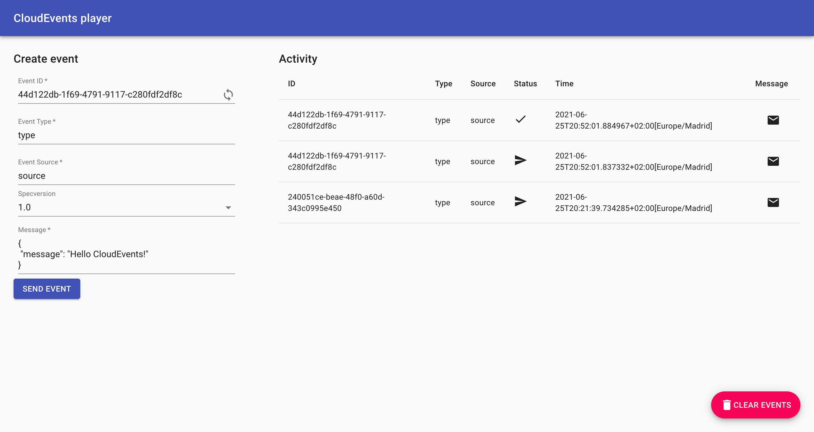

# 使用触发器和接收器

在上一个主题中，我们使用 CloudEvents Player 作为事件源向代理发送事件。
现在我们希望事件从 Broker 转移到事件接收器。

在本主题中，我们将使用 CloudEvents Player 作为接收器和源。
这意味着我们将使用 CloudEvents Player 来发送和接收事件。
我们将使用 Trigger 来监听 Broker 中要发送到接收器的事件。

## 创建第一个触发器

创建一个触发器，从事件源监听 CloudEvents，并将它们放入接收器中，这也是 CloudEvents Player 应用程序。

=== "kn"

    要创建触发器，运行以下命令:
    ```bash
    kn trigger create cloudevents-trigger --sink cloudevents-player  --broker example-broker
    ```

    !!! Success "Expected output"

        ```{ .bash .no-copy }
        Trigger 'cloudevents-trigger' successfully created in namespace 'default'.
        ```

=== "YAML"

    1.  将以下YAML复制到名为 `ce-trigger.yaml` 的文件中:
        ```bash
        apiVersion: eventing.knative.dev/v1
        kind: Trigger
        metadata:
          name: cloudevents-trigger
          annotations:
            knative-eventing-injection: enabled
        spec:
          broker: example-broker
          subscriber:
            ref:
              apiVersion: serving.knative.dev/v1
              kind: Service
              name: cloudevents-player
        ```

    1.  通过运行命令创建触发器:
        ```bash
        kubectl apply -f ce-trigger.yaml
        ```

        !!! Success "Expected output"
            ```{ .bash .no-copy }
            trigger.eventing.knative.dev/cloudevents-trigger created
            ```

??? question "我的触发器在听什么 CloudEvents ?"

    因为我们没有在`kn`命令中指定`--filter`，所以触发器正在监听进入代理的任何CloudEvents。

    展开下一个注释，查看如何使用过滤器。

现在，当我们返回到 CloudEvents Player 并发送一个事件时，我们看到 CloudEvents 既被 CloudEvents 发送，也被 CloudEvents Player 接收:

{draggable=false}

您可能需要刷新页面以查看更改。

??? question "如果我想过滤 CloudEvent 属性怎么办?"

    首先，删除现有的触发器: `kn trigger delete cloudevents-trigger `

    现在，让我们添加一个监听某个 CloudEvent 类型的触发器:
    `kn trigger create cloudevents-player-filter --sink cloudevents-player --broker example-broker --filter type=some-type `

    如果你发送一个类型为 `some-type` 的CloudEvent，它会反映在CloudEvents Player UI中。
    触发器忽略任何其他类型。

    您可以过滤CloudEvent的任何方面。

有些人称之为 **“事件驱动架构”** ，可以用来在 Kubernetes 上创建自己的 **“功能即服务”** :tada: :taco: :fire:。
